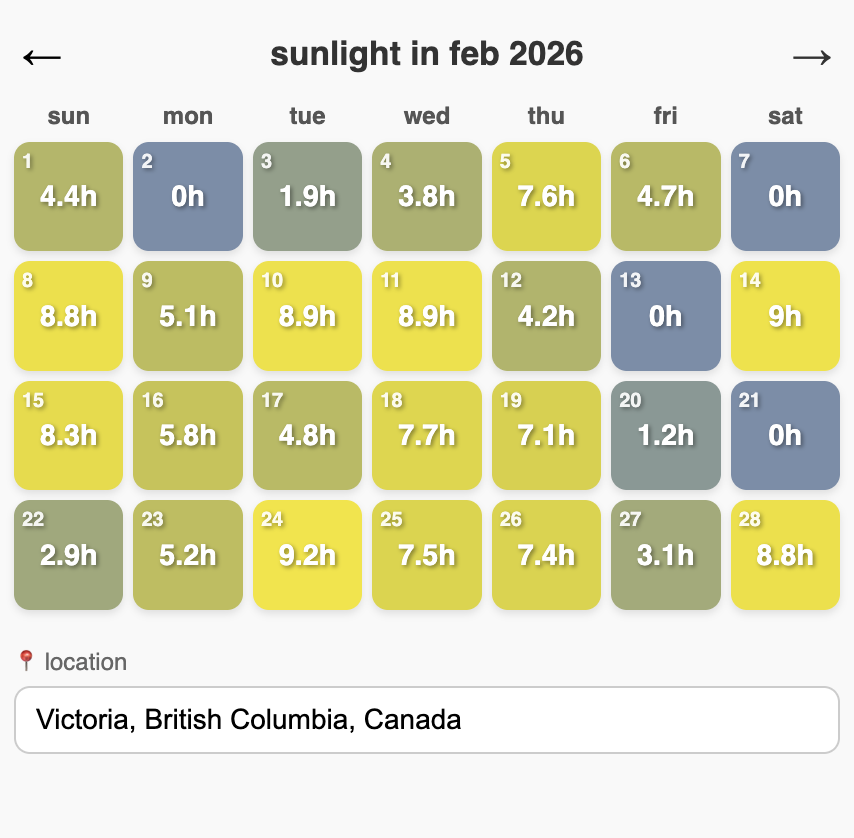
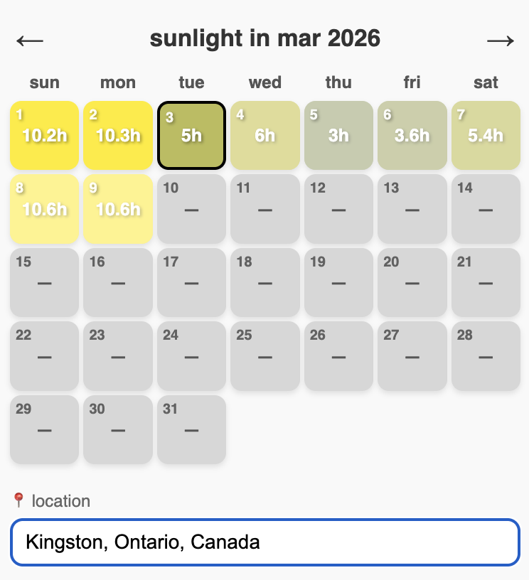

# sunlight-app

Simple static app that shows sunrise/sunset and daylight hours in a calendar view.

- Default location: Victoria, BC
- Supports location search
- Built as plain HTML/CSS/JS (no build step)

## APIs used

- Open-Meteo Geocoding API (`https://geocoding-api.open-meteo.com/v1/search`) for location search
- Open-Meteo Archive API (`https://archive-api.open-meteo.com/v1/archive`) for historical sunshine duration
- Open-Meteo Forecast API (`https://api.open-meteo.com/v1/forecast`) for upcoming sunshine duration

## Run

Open `index.html` in your browser.

## Screenshots

